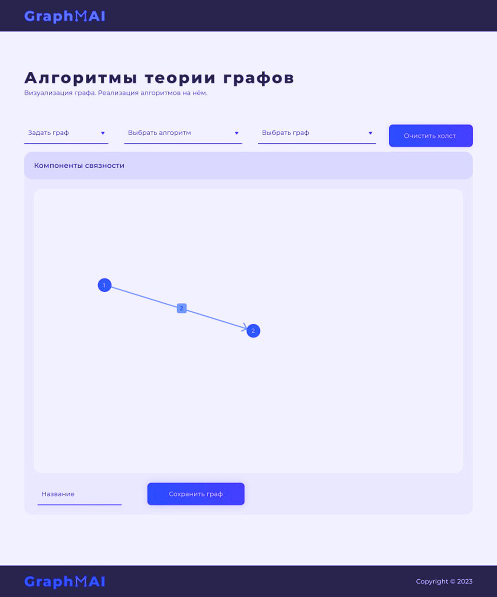

# GraphMAI

Проект *GraphMAI* - это веб-приложение, предоставляющее инструментарий для решения различных задач на графах.

***

### 📄 Основные поставленные задачи

* 💻 **Интерфейс**  
  Разработка графического интерфейса создания графа. Реализация разных способов задания графа, сохранения графа в базу данных, взаимодействия с существующими алгоритмами и написание сервисов к ним.

* 💾 **Хранение**  
  Проектирование базы данных для хранения графов. Написание моделей и контроллеров, отвечающих за обработку графа и дальнейшей загрузки его в базу данных.

* 🛠 **Алгоритмы**  
  Реализация сервисов, алгоритмов на графах. Написание моделей, моделей обмена и контроллеров, отвечающих за обработку графа конкретным алгоритмом.  

***

### 📄 Как выглядит приложение

  